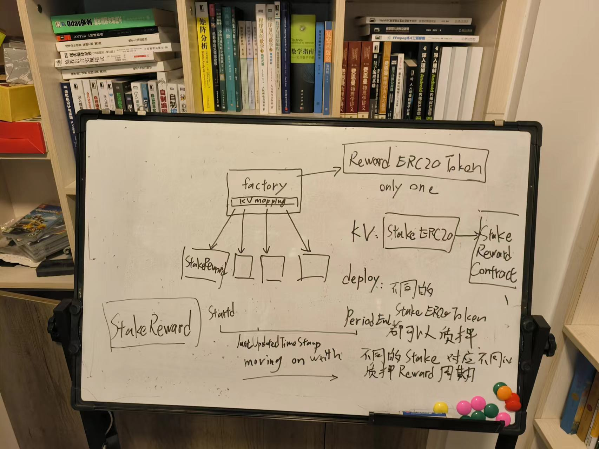

# uniswap-v2-staker

This is the canonical staking contract designed for [Uniswap V3](https://github.com/Uniswap/uniswap-v3-core).

## Arch



架构大概是这样的，有一个抵押奖励的工厂合约`StakingRewardsFactory`， 这个是deployer这样的owner独占的，它被创建的时候传递两个参数，第一个是将会奖励的ERC20的代币地址，第二个是这个合约真正开始工作的时间，就是一个时间戳。Factory合约维护多个抵押奖励的池子，因为它可以支持不同的ERC20代币作为抵押，但是奖励的代币只有一种，就是constructor传递的那个奖励代币。

每一个抵押的奖励池子，对应不同的stake代币，比如deploy了两个不同的stake 代币，那么就对应有两个`StakeReward`合约的地址，StakeReward合约是deploy方法里面动态new创建的。StakeReward于stake代币一一对应。

如果要抵押stake你想要的代币获取流动性挖矿奖励，需要拿到对应的stake代币的奖励池合约的地址(StakeReward合约地址),然后调用其的stake方法，经过一段时间以后，再调用getward函数获取奖励代币。或者调用exit方法，获取奖励代币的同时，也提取你所欲的抵押的代币赎回。

## Development and Testing

```sh
yarn
yarn test
```

##  Contracts Address

### Goerli Tesnet

v1 (deprecated):

- Deploying contracts with the account: `0x30B29E4615C6c7fcDF648Dc539dB7724743024c5` (not verified )
- UniswapV2ERC20 address is: `0x2e22a0114F829179BeCa340523aCdD7A4bd3A045` (not verified)
- My Reward ERC20 Token address is: `0x7ba75561E982A33F88C70259acB4759f186afe3F` (not verified)
- My Staking ERC20 Token address is: `0x623e205bAa59b24990df9B5d27343286Da9880bf` (not verified)
- StakingRewardsFactory address is: `0xd8914251939A3dc14a24D5e8dB72DEC4a669A673` (not verified)

v2:

- My Stake ERC20 Token Address `0xe2003461C2A2c2d18B5CF72ae992f75640ABbF52`   (verified on etherscan) https://goerli.etherscan.io/address/0xe2003461c2a2c2d18b5cf72ae992f75640abbf52 
- My Reward ERC20 Token Address `0xfC456971cF064cB610e6134dF3Bc3c861033052B` (verified on etherscan) https://goerli.etherscan.io/address/0xfc456971cf064cb610e6134df3bc3c861033052b
- UniswapV2ERC20 address `0x2c8D84ED5D3Aef8087A22B1f0d495bff395098FF` （veified on etherscan） https://goerli.etherscan.io/address/0x2c8d84ed5d3aef8087a22b1f0d495bff395098ff 
- StakingRwardsFactory address `0x4cB454a7499EaC89EeBf6295C541E51e9803E7d0` （verified on etherscan） https://goerli.etherscan.io/address/0x4cb454a7499eac89eebf6295c541e51e9803e7d0 
   - constructor(0xfC456971cF064cB610e6134dF3Bc3c861033052B, 1667185320)

## Deploy

```bash
yarn deploy:goerli
```

Or you can use remix IDE for deploying, Flattening solidity file and upload files to REMIX IDE to compile, deploy.

## TroubleShooting 

- https://github.com/Uniswap/v3-staker/issues/236

