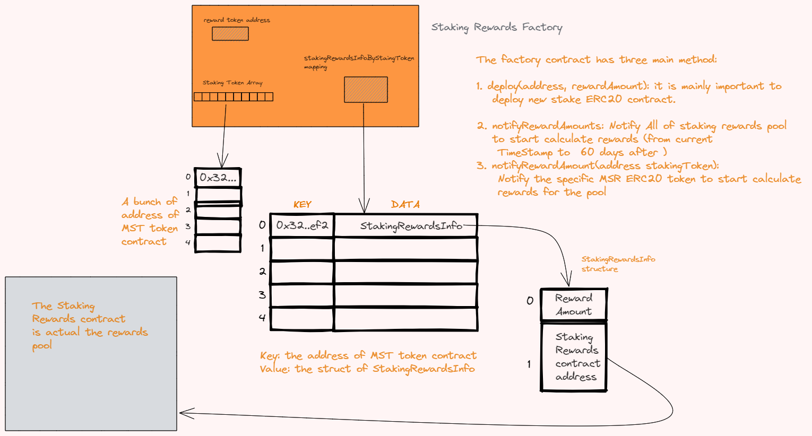
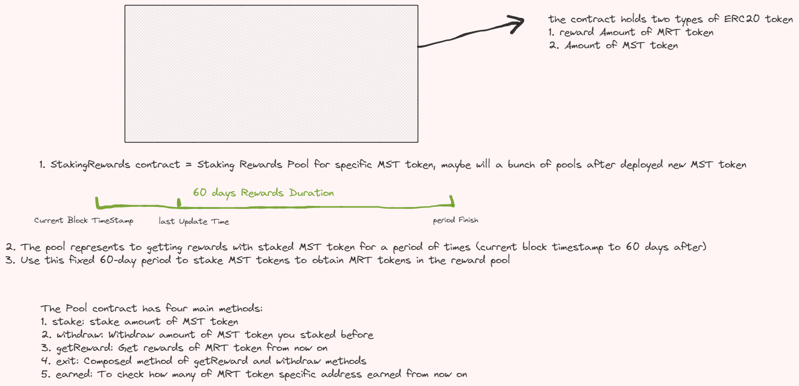

# uniswap-v2-staker


[](https://github.com/FiiLabs/v2-staker/tags/)

This is the canonical staking contract designed for [Uniswap V3](https://github.com/Uniswap/uniswap-v3-core).

> 这里做一下说明，虽然fork的是UniswapV3的staker，但是没有使用任何v3 staker的代码，而是v2的，v2的staker，我调查过，上线过一段时间又下线了。https://github.com/Uniswap/liquidity-staker 不知道是什么问题，仓库会被归档。我把v2的staker的合约代码拷贝过来使用的。

## Arch




架构大概是这样的，有一个抵押奖励的工厂合约`StakingRewardsFactory`， 这个是deployer这样的owner独占的，它被创建的时候传递两个参数，第一个是将会奖励的ERC20的代币地址，第二个是这个合约真正开始工作的时间，就是一个时间戳。Factory合约维护多个抵押奖励的池子，因为它可以支持不同的ERC20代币作为抵押，但是奖励的代币只有一种，就是constructor传递的那个奖励代币。

每一个抵押的奖励池子，对应不同的stake代币，比如deploy了两个不同的stake 代币，那么就对应有两个`StakeReward`合约的地址，StakeReward合约是deploy方法里面动态new创建的。StakeReward于stake代币一一对应。

如果要抵押stake你想要的代币获取流动性挖矿奖励，需要拿到对应的stake代币的奖励池合约的地址(StakeReward合约地址),然后调用其的stake方法，经过一段时间以后，再调用getward函数获取奖励代币。或者调用exit方法，获取奖励代币的同时，也提取你所欲的抵押的代币赎回。





LP token就是Uni-V2的代币，也就是UniswapV2ERC20。这个代币表示流动性的凭证。


## Get Started && How to simply use

### 1. 流动性挖矿

0. 先给Factory合约的地址充钱，充My Reward ERC20(MRT)代币的钱。

1. 首先，拥有owner权限的account调用Factory的`deploy`方法，传递流动性挖矿需要支持的抵押ERC20代币合约的地址，和奖励的额度。首先，Factory工厂合约要有reward ERC20代币的余额，不然奖励池没法进行工作。所以再次之前，先确认Factory合约的地址下，有一定数量的MRT这个ERC20 代币(My Reeward Token)。这个数量的代币，`deploy`(`stake erc20 token address`, `reward Amount`) rewardAmount

2. 然后调用Factory合约的 `notifyRewardAmounts()` 或者 `notifyRewardAmount(address MST token)`，通知并向流动性矿池转之前`deploy`时候设置的`rewardAmount`这个数量的代币。并开始进行60天的奖励周期，奖励开始计算。

3. 现在就可以使用StakingRewards的合约接口，比如用`stake`方法MST代币了，`getReward`方法提取质押期间所获得的MRT奖励。如果要提取抵押的MST的代币，可以用withdraw方法。用exit方法更直接，提取MRT奖励的同时也提取抵押的MST存款。

### 2. 单币质押分润模型-StakingRewarsFactory的新增接口

根据客户描述:

> 单币质押分润模型：
> 质押BALL分平台手续费；
> a. 质押$BALL，按照质押时间和质押数量，分享平台的手续费利润50%。
> b. 具体逻辑：平台收到手续费（应该是USDT）后，会定期（2天）从市场上回购 $BALL，并打进矿池。质押者会按一定速率挖取这个$BALL

那么Factory就定期打钱到Stake的池子中，如果每两天，打1个ball，那么就是，如果一个ball的decimal是1
e18，那么具体的接口参数就这样调用: `notifyRewardAmount2(stakingTokenAddress, 1000000000000000000)` 第一个参数就是支持质押的代币的地址，对应分润模型，也是ball代币的地址，第二个参数就是将要打进去的奖励代币数额（在这里是ball代币），这样依次类推，owner想定期打钱就调用这个接口，这里打钱的奖励数额，以上的调用例子就是在一定时间区间（时间区间为内部硬编码）内按一定速率瓜分1个ball代币。

## Development and Testing

```sh
yarn
yarn test
```

##  Contracts Address

### Goerli Tesnet

#### v4

这个版本增加了[这个](docs/distribute-ball-design-v2.md) 功能。(注意，没有锁定stake 48小时的功能)

Deploying contracts with the account: `0x30B29E4615C6c7fcDF648Dc539dB7724743024c5`

- StakingRewardsFactory address `0x58f42b3Ce1fb37662d5f0e5542856B0C2D49d30d` https://goerli.etherscan.io/address/0x58f42b3Ce1fb37662d5f0e5542856B0C2D49d30d
   - constructor(`0xc01C97800cbD85f39aE204e9510c400B27F9C93B`， `1667977116`)

- deployed(`0xA00eFA5eFBba8820c4C1aF409b9e95E68C628Bb2`)
   - Staking Pool address `0x0fC048f90116824694B74f9B4F1E6d3E3D59318e`
   - constructor(`0x58f42b3Ce1fb37662d5f0e5542856B0C2D49d30d`,`0xc01C97800cbD85f39aE204e9510c400B27F9C93B`,`0xA00eFA5eFBba8820c4C1aF409b9e95E68C628Bb2`)

https://goerli.etherscan.io/address/0x0fc048f90116824694b74f9b4f1e6d3e3d59318e


- deployed(`0x8eFcEe520a44C8dC8834109ED39a70CcAADD1302`)
   - Staking Pool address `0x43509e25474fe6c84fEAf7B042D581eD52DF76c7`
   - constructor(`0x58f42b3Ce1fb37662d5f0e5542856B0C2D49d30d`,`0xc01C97800cbD85f39aE204e9510c400B27F9C93B`,`0x8eFcEe520a44C8dC8834109ED39a70CcAADD1302`)

https://goerli.etherscan.io/address/0x43509e25474fe6c84feaf7b042d581ed52df76c7


#### v3

这个版本增加了[这个](docs/distribute-ball-design.md) 功能。

Deploying contracts with the account: `0x30B29E4615C6c7fcDF648Dc539dB7724743024c5`

- StakingRewardsFactory address `0x4C8f539D0CC987E72a001E77456d10c5A046C8BF` https://goerli.etherscan.io/address/0x4c8f539d0cc987e72a001e77456d10c5a046c8bf
   - constructor(`0xc01C97800cbD85f39aE204e9510c400B27F9C93B`， `1667871156`)

Deployed Staking Rewards pool:

- StakingRewards address(UniswapV2Pair) `0xb7010d3AEFa27A7B5eF9FC78bEC472E9D9204829` https://goerli.etherscan.io/address/0xb7010d3AEFa27A7B5eF9FC78bEC472E9D9204829
   - constructor(`0x4C8f539D0CC987E72a001E77456d10c5A046C8BF`, `0xc01C97800cbD85f39aE204e9510c400B27F9C93B`, `0xFC5EB7FDd4d1Af0CEAf9B2b2E40CD8085A31c280`) 

#### v2

Deploying contracts with the account: `0x30B29E4615C6c7fcDF648Dc539dB7724743024c5`

- My Stake ERC20 Token(MST) Address `0x138F183171C849c6A7437A7E60C9ac28CEc66D07`   (verified on etherscan) https://goerli.etherscan.io/address/0x138f183171c849c6a7437a7e60c9ac28cec66d07 
- My Reward ERC20（MRT） Token Address `0xc01C97800cbD85f39aE204e9510c400B27F9C93B` (verified on etherscan) https://goerli.etherscan.io/address/0xc01c97800cbd85f39ae204e9510c400b27f9c93b
- UniswapV2ERC20 address `0x2c8D84ED5D3Aef8087A22B1f0d495bff395098FF` （veified on etherscan） https://goerli.etherscan.io/address/0x2c8d84ed5d3aef8087a22b1f0d495bff395098ff 
- StakingRwardsFactory address `0xF0335B3F3baa36E32dfA5dFcC224C5D5c4654081` （verified on etherscan） https://goerli.etherscan.io/address/0xf0335b3f3baa36e32dfa5dfcc224c5d5c4654081 
   - constructor(`0xc01C97800cbD85f39aE204e9510c400B27F9C93B`, `1667299572`) 第一个参数是MRT代币的地址，奖励是奖励MRT代币，第二个参数是开始流动性挖矿开始工作的时间戳，设置是部署时间 + 半个小时以后

Deployed Staking Rewards pool：

- StakingRewards address(MST) `0x1B99525B56FA1eC891f711BbD3506af9d3110243` (verified on etherscan) https://goerli.etherscan.io/address/0x1B99525B56FA1eC891f711BbD3506af9d3110243
  - constructor(`0xF0335B3F3baa36E32dfA5dFcC224C5D5c4654081`， `0xc01C97800cbD85f39aE204e9510c400B27F9C93B`, `0x138F183171C849c6A7437A7E60C9ac28CEc66D07`) 第一个参数是factory的地址，第二个参数是MRT的地址，第三个参数是MST的地址

- StakingRewards address(UniswapV2Pair) `0xc3f204df7bd5823031e264ddb3a45b6c3aca4885` (veridied on etherscan) https://goerli.etherscan.io/address/0xc3f204df7bd5823031e264ddb3a45b6c3aca4885
   - constructor(`0xF0335B3F3baa36E32dfA5dFcC224C5D5c4654081`, `0xc01C97800cbD85f39aE204e9510c400B27F9C93B`, `0xFC5EB7FDd4d1Af0CEAf9B2b2E40CD8085A31c280`) 

#### v1 (deprecated)

Deploying contracts with the account: `0x30B29E4615C6c7fcDF648Dc539dB7724743024c5`

- <del> UniswapV2ERC20 address is: `0x2e22a0114F829179BeCa340523aCdD7A4bd3A045` (not verified) </del>
- <del> My Reward ERC20 Token address is: `0x7ba75561E982A33F88C70259acB4759f186afe3F` (not verified) </del>
- <del> My Staking ERC20 Token address is: `0x623e205bAa59b24990df9B5d27343286Da9880bf` (not verified) </del>
- <del> StakingRewardsFactory address is: `0xd8914251939A3dc14a24D5e8dB72DEC4a669A673` (not verified) </del> 

## Deploy

```bash
yarn deploy:goerli # deploy to goerli testnet

# deploy to hardhat local network for testing
yarn localnode # to run a local node for hardhat network
yarn deploy:hardhat # deploy contracts to hardhat
```

Or you can use remix IDE for deploying, Flattening solidity file and upload files to REMIX IDE to compile, deploy.

只需要部署StakingRewardsFactory即可，通过Factory部署想要质押的ERC20代币的矿池。

```bash
multisol ./contracts/StakingRewardsFactory.sol # for flattening sol
```

## 基于官方资料的一点分析

### Uniswap

- https://docs.uniswap.org/protocol/V2/introduction ，该uniswap V2中的文档，没有找到关于Staker的说明和介绍 https://github.com/Uniswap/liquidity-staker ，只有交易池的流动性相关的说明。v1的文档就更没有流动性挖矿的文档介绍了https://docs.uniswap.org/protocol/V1/guides/connect-to-uniswap， 相当于liquidity staker这个仓库的合约没有上线，也没有与uniswap中的联动起来做DeFi。
- 包括v2-core和v2-periphery的仓库中的合约，也没有找到其合约对Staker的调用，感觉v2的staker是一个完全独立的模块。而且uniswap V2的前端界面中，也没有找到stake相关的页面。
- uniswap V3版本，就有对应的流动性挖矿的文档页面说明了 https://docs.uniswap.org/protocol/guides/liquidity-mining/liquidity-mining-overview 也有对应的v3 staker https://github.com/Uniswap/v3-staker 

所以目前只能根据V3的staker来分析它的stake是怎么运作的，官方文档对staker定义了一些参数:

```txt
Let's start by defining some terms. We refer to programs which incentivize liquidity as Incentives; they're characterized by the following parameters:

rewardToken: Perhaps the most important parameter, would-be incentivizers must pick the ERC20 token which they would like to distribute as a reward for providing liquidity.
pool: The address of the Uniswap V3 pool in which liquidity must be provided.
startTime: The UNIX timestamp at which rewards start to be distributed.
endTime: The UNIX timestamp at which rewards start to decay.
refundee: The address which has the right to reclaim any leftover rewards after the Incentive has concluded.

Finally, every Incentive has an associated reward, the total amount of rewardTokens that are allocated to be distributed over the lifecycle of the program.
```

相当于v3 staker抵押获取的reward token也没有强制指定是哪种ERC20，至于stake的token，从代码上看好像是抵押NFT资产。https://github.com/Uniswap/v3-staker/blob/4328b957701de8bed83689aa22c32eda7928d5ab/contracts/UniswapV3Staker.sol#L188-L209 

v3的[文档](https://docs.uniswap.org/protocol/guides/liquidity-mining/liquidity-mining-overview#staking) 上也说明了:

```txt
So, how do users participate in these programs? Note that this section requires a basic understanding of how Uniswap V3 position NFTs work.

The first action a user must take in order to begin participating in an Incentive is to deposit their position NFT into the canonical staking contract address, effectively temporarily giving custody over their NFT to this contract. This is necessary because, as we'll see later on, the staking contract needs to be able to guarantee that liquidity cannot be removed from NFTs participating in the program.

Once deposited, a user may then stake their NFT into any number of active Incentives for the Uniswap V3 pool their NFT is tied to (note that this can happen atomically with an initial deposit). Staked NFTs then immediately start to earn rewards, according to the algorithm outlined above. Users may periodically claim accrued rewardTokens while the program is ongoing, or wait to claim until the program has concluded to minimize overhead.
```

### Sushiswap

据说，sushiswap也有流动性挖矿，所以它的Farm我也调研了一下，就是流动性挖矿，抵押一个LP token，然后获取sushi代币的奖励，之前那个LP token是支持UniswapV2的Uni-v2代币的，但是现在不支持了 https://help.sushidocs.com/products/sushiswap-farms-menu :

```txt
The SushiSwap Farms (Menu) are located here:

https://sushiswapclassic.org/farms

The Farm allows users to yield farm Sushi rewards with each new block based on staking SLP tokens they received from exchange.sushiswapclassic.org/#/pool 

The farm previously supported UNI-V2 LP tokens from Uniswap but it now only works with tokens from SushiSwap pools.
```

然后我找到了sushi的Stake和chef合约，Stake合约。其中chef合约的抵押和取款，包括通知奖励池的方式与UniswapV2的staker原理差不多 https://github.com/sushiswap/sushiswap/blob/2c8f91841b6050a2988aa849afddd24ce2a7e42c/protocols/masterchef/contracts/MasterChefV2.sol#L175-L204 ，暂时没有找到以前与UNI-v2对接的合约。Stake合约的初始化构建参数与uniswap的staker的基于一样，都有设置stake token，reward tokne，还有开始时间和结束时间戳 https://github.com/sushiswap/StakingContract/blob/bf0a87fba596d831552aa9f5c40aa49df0057c2a/src/StakingContractMainnet.sol#L72-L106 其中 https://github.com/sushiswap/StakingContract/blob/bf0a87fba596d831552aa9f5c40aa49df0057c2a/src/StakingContractMainnet.sol#L108-L113 方法对应的就是uniswap v2-staker中Factory的notifyRewardsAmount(address stakeToken)这个方法，大同小异。就是对奖励的时间区间和奖励进行变更。

sushiswap的StakingContract和https://learnblockchain.cn/article/2128 题里面提到的MasterChef合约，感觉都是流动性挖矿，都可以抵押和赚取奖励。但是由于 https://learnblockchain.cn/article/2128 提到的代码，应该是MasterChef的是流动性挖矿的概率更大，因为里面提到了LP token了。https://github.com/sushiswap/sushiswap/blob/master/protocols/masterchef/contracts/MasterChef.sol

MasterChef有V1和V2版本。大同小异。


## TroubleShooting 

- https://github.com/Uniswap/v3-staker/issues/236

